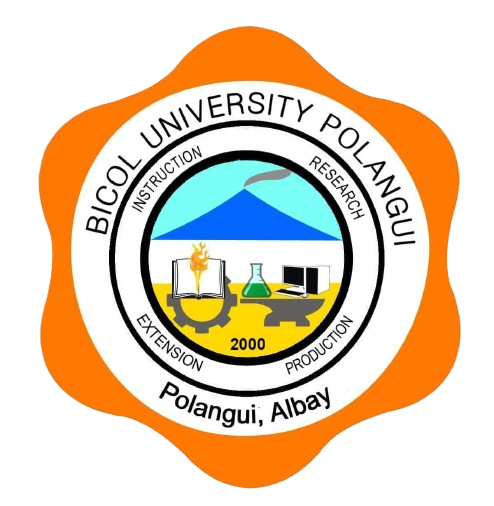

<div align="center">
  <h1>Bicol University Polangui - Student Management System (S.M.S)</h1>
</div>

<div align="center">
  
  <h3>The Smart Way to Manage Success</h3>
  <p>A comprehensive, production-ready Student Management System built with Native PHP and MySQL, designed to manage student records efficiently.</p>

[]()

  <br/>


</div>

## 📋 Overview

The **Bicol University Polangui S.M.S** is a robust web application designed to streamline the management of student information. It serves as a centralized platform for administrators to maintain accurate records, including course details, year levels, and department assignments, while providing a modern and accessible interface for both admins and users.

## ✨ Features

### 🎓 Admin Dashboard

- **Overview Statistics:** Real-time view of total students, system users, and recent activity.
- **Student Management:**
  - Add new students with **auto-assigned departments** based on course selection.
  - Comprehensive editing (Name, ID, Course, Year, Block, Gender).
  - Delete student records.
  - Secure profile photo management (stored as BLOBs).
- **Directory Control:**
  - Full control to manage data integrity.

### 📂 Students Directory & Department Selection

- **Department Directory:** A visual and interactive entry point where users select a department (Computer Studies, Engineering, Nursing, etc.) before viewing student lists. Each department is represented by a distinct color and icon for easy navigation.
- **Course-Based Filtering:** Once inside a department, filter students specifically by **Course** (e.g., BSIT, BSCS) instead of the broad department category.
- **Advanced Filtering:** Dynamic filters for Year Level, Block, and Gender.
- **Smart Sorting:** Sort by Name, Date Added, Recently Modified, Year Level, and more.
- **Global Search:** Instant search functionality for Student Names and IDs.

### 👤 User Dashboard

- **Overview Statistics:** Real-time view of total students and recent activity.
- **Student Management:**
  - Add new students with **auto-assigned departments**.
  - **Read-Only Mode:** Users cannot edit or delete existing student records.
- **Profile Management:** Update personal credentials and profile avatar.
- **Simplified Interface:** Focused view for non-admin users.

### 🔐 Security & Tech

- **Authentication:** Secure Login/Signup with password hashing (`password_hash`).
- **Role-Based Access:** Distinct Admin and User privileges.
- **Database:** Optimized MySQL schema with relationships and constraints.

## 🚀 Getting Started

### Prerequisites

- **XAMPP** (or any local server with Apache & MySQL)
- **Git** (optional, for cloning)
- A modern web browser

### Installation

1.  **Clone or Download**
    Navigate to your XAMPP `htdocs` directory and clone the repo:

    ```bash
    cd C:\xampp\htdocs\
    git clone https://github.com/tsugumii21/BU-Polangui-Student-Management-System.git student_management_system
    ```

    _(Or simply create a folder `student_management_system` and paste the files there)_

2.  **Setup Database**

    - Open **XAMPP Control Panel** -> Start **Apache** & **MySQL**.
    - Go to `http://localhost/phpmyadmin/`.
    - Create a database named: **`student_management_db`**.
    - Import the **`database/student_management_db.sql`** file provided in the project.

3.  **Configure (Optional)**

    - Check `database/config.php` if you have a custom MySQL password. Default is empty for `root`.

4.  **Launch**
    - Open browser and go to: **`http://localhost/student_management_system/frontend/`**

### Login Credentials

| Role      | Username             | Password        |
| --------- | -------------------- | --------------- |
| **Admin** | `admin`              | `123456`        |
| **User**  | _(Sign up via form)_ | _(Your Choice)_ |

## 📂 Project Structure

```
student_management_system/
├── backend/                  # Server-side Logic
│   ├── image.php             # Image serving & placeholder logic
│   ├── login.php             # Authentication processing
│   ├── logout.php            # Session termination
│   ├── search_handler.php    # Live search API
│   └── signup.php            # User registration
├── database/                 # Database Configuration
│   ├── config.php            # PDO connection setup
│   └── student_management_db.sql # Database schema & seed data
├── frontend/                 # Client-side Interface
│   ├── css/                  # Stylesheets (style.css)
│   ├── images/               # Static assets & placeholders
│   ├── includes/             # Components (header_offcanvas.php)
│   ├── js/                   # Scripts (script.js)
│   ├── department_selection.php # Department entry point
│   ├── index_admin.php       # Admin Dashboard
│   ├── index_user.php        # User Dashboard
│   ├── index.html            # Landing Page
│   ├── login.html            # Login Form
│   ├── signup.html           # Signup Form
│   ├── profile.php           # User Profile Settings
│   ├── student_dashboard_admin.php # Add/Edit Student (Admin)
│   ├── student_dashboard_user.php  # Add/View Student (User)
│   ├── students_list_admin.php     # Student Records (Admin)
│   └── students_list_user.php      # Student Records (User)
└── README.md                 # Project Documentation
```

---

## 👥 Development Team

**BSIT-3A**

- **Leader:** Allen Del Valle
- **Members:**
  - Michael Justin Surbano
  - Asthan Eilexer Patanao
  - Carlo Delos Santos
  - John Roan Ballester

---

## ⚠️ Disclaimer

This project is developed for **educational purposes only**. It is an independent project and is **not affiliated, associated, authorized, endorsed by, or in any way officially connected** with Bicol University Polangui or any of its subsidiaries or its affiliates. The official Bicol University website can be found at [bicol-u.edu.ph](https://bicol-u.edu.ph).

---

<div align="center">
  <p>© 2025 Bicol University Polangui. All Rights Reserved.</p>
</div>
